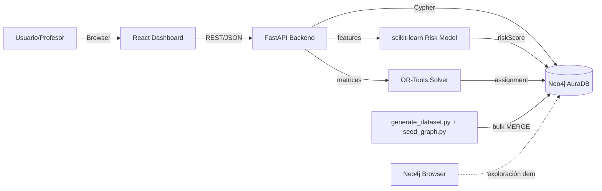
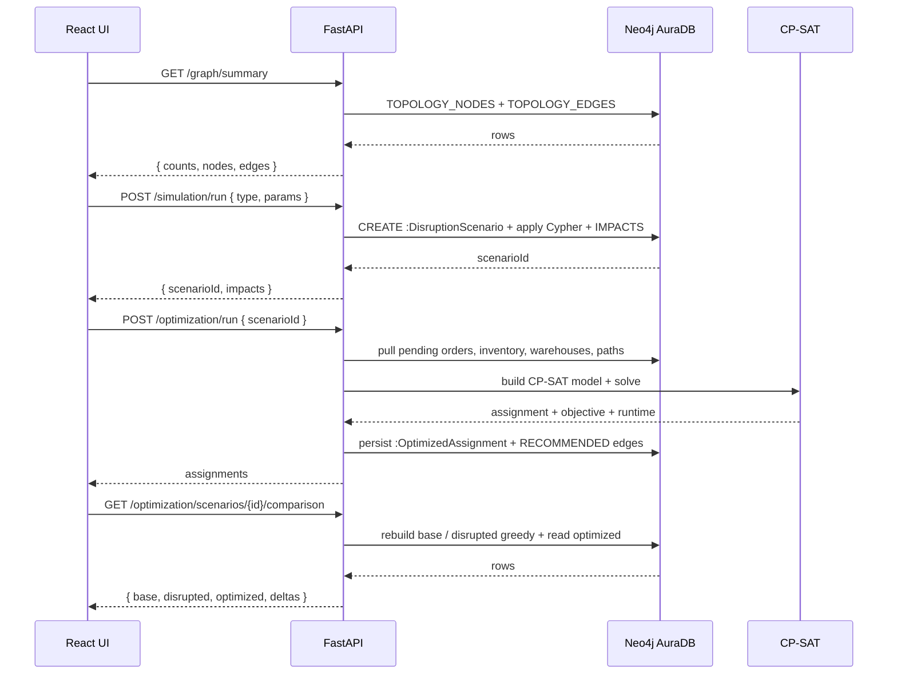

# Architecture

## Components

- **Neo4j AuraDB** — primary data store, holds the topology, inventory,
  orders, scenarios and optimization results.
- **FastAPI backend** (Python 3.11+) — gateway between the UI and Neo4j /
  OR-Tools / scikit-learn. Imports the official Neo4j driver and exposes a
  reusable `Neo4jClient` singleton.
- **OR-Tools CP-SAT solver** — runs in-process inside the backend. Inputs
  come from Neo4j via `app.optimization.data_loader`, outputs are persisted
  via `app.optimization.writeback`.
- **scikit-learn RandomForest** — small classifier living under
  `app/ml/`. It pulls features from Neo4j, persists a joblib artifact, and
  pushes new `riskScore` values back into the graph.
- **React dashboard** — Vite + Tailwind. Talks to the backend via `/api`.

## Diagram

## Request flow for a typical demo cycle

## Boundaries / why each piece is separate

- Anything **descriptive** ("what depends on what", "what alternatives
  exist", "what becomes unreachable") lives in **Cypher**.
- Anything **prescriptive** ("which warehouse should fulfil this order
  given inventory and capacity") lives in **OR-Tools**.
- Anything **predictive** ("how risky is this supplier given history") lives
  in **scikit-learn**.

This separation is the academic spine of the project. Mixing them into a
single layer would defeat the rationale for using a graph database in the
first place.
