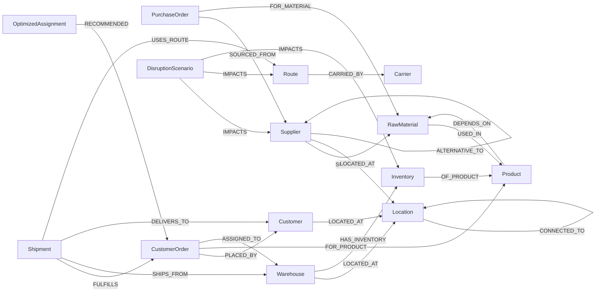

# Modelo de datos en Neo4j

Este documento define el modelo de grafo del sistema de análisis y optimización de cadena de suministro. Sirve como contrato entre la generación del dataset, los scripts de carga y las consultas Cypher.

## Diagrama conceptual

## Nodos

| Label | Propiedad clave | Otras propiedades | Propósito |
|---|---|---|---|
| `Supplier` | `id` | `name`, `country`, `riskScore` (0..1), `status` (`active`/`inactive`), `capacityPerWeek`, `isCertified` (Boolean), `certifications` (List<String>), `registeredOn` (Date), `lastAuditAt` (DateTime), `_baselineStatus` (opcional) | Quién provee materias primas |
| `RawMaterial` | `id` | `name`, `unit`, `criticality` (`low`/`med`/`high`) | Insumo que entra en productos |
| `Product` | `id` | `sku`, `name`, `category`, `unitCost` | Producto terminado |
| `Warehouse` | `id` | `name`, `region`, `storageCapacity`, `dispatchCapacityPerWeek` | Centro de distribución |
| `Inventory` | `id` | `quantity`, `safetyStock`, `reorderPoint`, `_baselineQuantity` (opcional) | Stock por (Warehouse, Product) |
| `PurchaseOrder` | `id` | `quantity`, `placedAt`, `expectedAt`, `status` | Pedido a proveedor |
| `CustomerOrder` | `id` | `quantity`, `dueDate`, `priority` (1=high,2=med,3=low), `status` (`pending`/`fulfilled`/`cancelled`), `revenue`, `_baselineQuantity` (opcional) | Pedido del cliente |
| `Shipment` | `id` | `dispatchedAt`, `status`, `delayDays` | Envío físico |
| `Route` | `id` | `mode` (`road`/`sea`/`air`), `distanceKm`, `status` | Tramo lógico (la propiedad de costo vive en `CONNECTED_TO`) |
| `Carrier` | `id` | `name`, `reliabilityScore` (0..1) | Transportista |
| `Location` | `id` | `name`, `country`, `latitude`, `longitude`, `coords` (`Point` WGS-84), `type` (`port`/`city`/`hub`) | Punto geográfico |
| `Customer` | `id` | `name`, `region`, `tier` (`gold`/`silver`/`bronze`) | Cliente final |
| `DisruptionScenario` | `id` | `type`, `description`, `createdAt`, `status` (`active`/`resolved`), `params` (JSON string) | Snapshot de una disrupción simulada |
| `OptimizedAssignment` | `id` | `scenarioId`, `objectiveValue`, `solvedAt`, `runtimeMs` | Resultado del optimizador |

## Relaciones

| Tipo | Origen → Destino | Propiedades | Por qué importa |
|---|---|---|---|
| `SUPPLIES` | `Supplier` → `RawMaterial` | `unitCost`, `leadTimeDays`, `minOrderQty` | Quién puede vender qué y a qué costo |
| `USED_IN` | `RawMaterial` → `Product` | `quantityPerUnit` | BOM (bill of materials) |
| `DEPENDS_ON` | `Product` → `RawMaterial` | `criticalityWeight` | Atajo derivado para análisis rápido |
| `HAS_INVENTORY` | `Warehouse` → `Inventory` | — | Conexión a stock |
| `OF_PRODUCT` | `Inventory` → `Product` | — | Producto del stock |
| `LOCATED_AT` | `Warehouse`/`Supplier`/`Customer` → `Location` | — | Ubicación física |
| `CONNECTED_TO` | `Location` → `Location` | `routeId`, `distanceKm`, `baseCost`, `leadTimeDays`, `status` (`open`/`blocked`), `_baselineStatus`, `_baselineCost` | Topología de transporte (se asume bidireccional consultando sin dirección) |
| `CARRIED_BY` | `Route` → `Carrier` | `costMultiplier` | Quién opera la ruta |
| `FULFILLS` | `Shipment` → `CustomerOrder` | `fulfillmentPct` | Trazabilidad de cumplimiento |
| `SHIPS_FROM` | `Shipment` → `Warehouse` | — | Origen del envío |
| `DELIVERS_TO` | `Shipment` → `Customer` | — | Destino |
| `USES_ROUTE` | `Shipment` → `Route` | `actualLeadTime` | Ruta real del envío |
| `PLACED_BY` | `CustomerOrder` → `Customer` | — | Quién pidió |
| `FOR_PRODUCT` | `CustomerOrder` → `Product` | `quantity` | Qué pidieron |
| `SOURCED_FROM` | `PurchaseOrder` → `Supplier` | — | A quién se le compró |
| `FOR_MATERIAL` | `PurchaseOrder` → `RawMaterial` | — | Qué materia prima se pidió |
| `IMPACTS` | `DisruptionScenario` → `Supplier`/`Route`/`Warehouse`/`Inventory` | `severity` (1..3), `simulatedAt` | Materializa impacto |
| `ALTERNATIVE_TO` | `Supplier` → `Supplier` | `costDelta`, `leadTimeDelta` | Plan B explícito |
| `RECOMMENDED` | `OptimizedAssignment` → `CustomerOrder` | `cost`, `leadTime`, `risk`, `warehouseId` | Salida del optimizador |
| `ASSIGNED_TO` | `CustomerOrder` → `Warehouse` | `scenarioId`, `assignedAt` | Asignación física resultante |

## Reglas de modelado

1. **Costo y lead time viven en `CONNECTED_TO`** (no en `Route`) porque caracterizan el tramo entre dos `Location`s y permiten acumular costos sumando propiedades de relaciones en un path. `Route` queda como entidad lógica reusable.
2. **`riskScore` vive en `Supplier`** porque es atributo del actor; el ML lo recalcula y reescribe.
3. **`status` vive en nodos y en relaciones según corresponda**:
   - Un `Supplier` `inactive` invalida todas sus aristas `SUPPLIES`.
   - Una relación `CONNECTED_TO` `blocked` solo invalida ese tramo.
4. **`Inventory` es nodo, no propiedad de `Warehouse`** para permitir múltiples (Warehouse, Product) y queries del tipo "todo el inventario crítico bajo `safetyStock`".
5. **`DEPENDS_ON` es relación derivada** (computada al cargar) para acelerar consultas comunes sin recorrer multi-hop por `USED_IN` con `quantityPerUnit`.
6. **Propiedades `_baseline*`** se usan exclusivamente por el motor de simulación para guardar valores originales antes de aplicar una disrupción y permitir revertir.
7. **`CONNECTED_TO` se consulta sin dirección** (`-[:CONNECTED_TO]-`). Al cargar, sólo se inserta una arista por par (origen, destino).
8. **IDs textuales con prefijo** por label para legibilidad y unicidad cruzada en logs (`S1`, `RM2`, `P3`, `W4`, `INV5`, `CO6`, `PO7`, `SH8`, `LOC9`, `CAR10`, `CUST11`, `R12`, `DS13`, `OA14`).

## Convenciones de tipos

- Numéricos: `Integer` para cantidades y días, `Float` para scores y costos.
- Booleanos: `status` se mantiene como `String` enumerado para extensibilidad; los flags binarios reales (p.ej. `Supplier.isCertified`) usan `Boolean`.
- Fechas y horas: usamos los tipos nativos de Neo4j `Date` (p.ej. `Supplier.registeredOn`) y `DateTime` (p.ej. `Supplier.lastAuditAt`). En los JSON intermedios viajan como strings ISO y el seed los convierte con `date(...)` y `datetime(...)`.
- Listas: `Supplier.certifications` es un `List<String>`.
- Coordenadas: `Location.coords` es un `Point` WGS-84 (`point({latitude, longitude, srid: 4326})`).

### Cobertura de tipos de datos Neo4j (rúbrica criterio 3)

| Tipo Neo4j | Dónde se usa | Ejemplo |
|---|---|---|
| `String` | `Supplier.name`, `Product.sku`, `Route.mode`, etc. | `"Pacific Components Ltd"` |
| `Integer` | `Warehouse.storageCapacity`, `CustomerOrder.priority` | `25000` |
| `Float` | `Supplier.riskScore`, `CONNECTED_TO.baseCost` | `0.62` |
| `Boolean` | `Supplier.isCertified` | `true` |
| `Date` | `Supplier.registeredOn` | `date("2014-08-22")` |
| `DateTime` | `Supplier.lastAuditAt` | `datetime("2025-09-12T10:42:00Z")` |
| `List` | `Supplier.certifications` | `["ISO9001", "ISO14001"]` |
| `Point` | `Location.coords` | `point({latitude: 35.68, longitude: 139.69, srid: 4326})` |

## Volumen objetivo del dataset MVP

- 8 `Supplier`, 6 `RawMaterial`, 15 `Product`, 5 `Warehouse`, ~30 `Inventory`, 4 `Carrier`, 12 `Location`, ~28 relaciones `CONNECTED_TO` (con duplicidades intencionales para alternativas), 30 `PurchaseOrder`, 50 `CustomerOrder`, 40 `Shipment`, ~20 `Customer`.

## Casos demo cubiertos por el modelo

- **Trazabilidad multi-hop:** `(Supplier)-[:SUPPLIES]->(RawMaterial)-[:USED_IN]->(Product)<-[:FOR_PRODUCT]-(CustomerOrder)-[:PLACED_BY]->(Customer)`.
- **Single-source de materias primas:** materias con sólo un `Supplier` activo conectado por `SUPPLIES`.
- **Rutas alternativas:** múltiples paths `(Location)-[:CONNECTED_TO*1..4]-(Location)` con `status='open'`.
- **Impacto de disrupción:** `(DisruptionScenario)-[:IMPACTS]->(target)` materializado para análisis y revert.
- **Asignación optimizada:** `(OptimizedAssignment)-[:RECOMMENDED]->(CustomerOrder)` con métricas por asignación.
